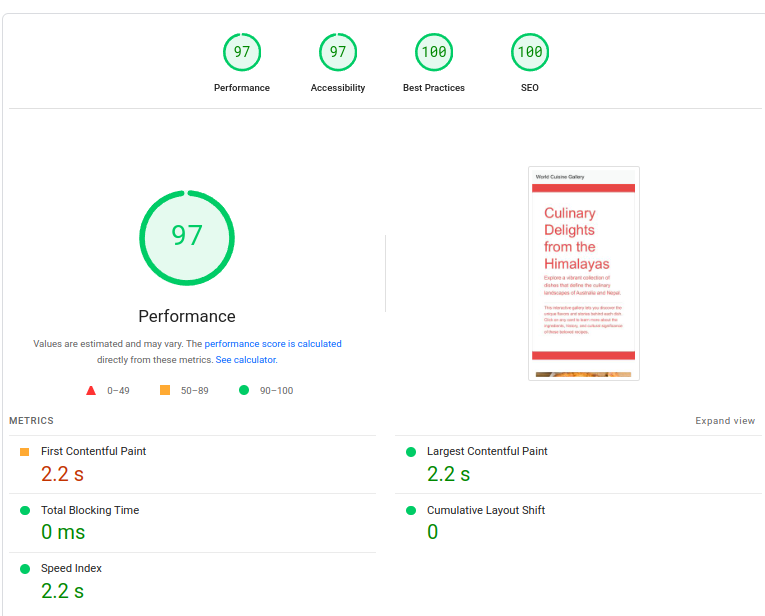

# Project Brief: World Cuisine Gallery

## Introduction

The World Cuisine Gallery is an engaging, interactive web application designed to educate and showcase the diverse culinary traditions of Australia and Nepal. This project is developed to provide insights into the flavors, cooking techniques, and cultural significance of various dishes, promoting cultural understanding and appreciation through a digital medium.

## Objectives

- **Educate users** about the traditional dishes from Australia and Nepal.
- **Promote cultural understanding** and appreciation through culinary exploration.
- **Provide an interactive experience** that is both educational and engaging for users of all ages.

## Key Features

- **Interactive Dish Cards:** Each dish is presented through an interactive card that reveals detailed information and vivid images upon clicking.
- **Responsive Design:** The website is optimized for all devices, ensuring a seamless experience on desktops, tablets, and smartphones.
- **High Accessibility:** Accessibility is a core focus, making the website navigable and usable for people with disabilities.

## Technology Stack

- **HTML5 and CSS3:** For structuring and styling the website.
- **JavaScript and Bootstrap:** For dynamic interactions and responsive layout.

## Testing

The website has undergone extensive testing, including Lighthouse assessments to ensure high performance, accessibility, best practices, and SEO optimization.

**Lighthouse Scores:**
- **Performance:** 97
- **Accessibility:** 97
- **Best Practices:** 100
- **SEO:** 100

Detailed Lighthouse results can be viewed here: 

## Deployment

This project is hosted and publicly available, intended for anyone interested in the culinary arts and cultural heritage of Australia and Nepal. Can be accessed through : [Github Page](https://jani672.github.io/hit/)

## Conclusion

The World Cuisine Gallery serves as a digital bridge connecting diverse cultures through the universal language of food. It offers a rich, interactive experience that educates, informs, and entertains a global audience.

